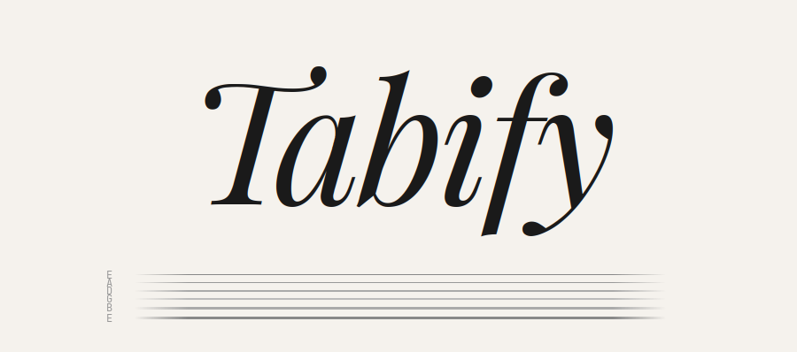

# Tabify

A guitar arrangement tool — web editor.

Write and edit guitar tablature with techniques, left/right hand finger notation, and printable export. No accounts, no frameworks, no dependencies.

## Web Editor

Open `editor.html` in a browser or visit the [hosted version](https://tabifyeditor.vercel.app).

- 16th-note grid editor with 6-string tablature
- Techniques: hammer-on, pull-off, slide, bend, vibrato, harmonics (natural + artificial)
- Finger notation: L.H. (1-2-3-4) and R.H. (P-I-M-A-C)
- Interactive fretboard with scale overlays — adapts to any tuning including custom
- Custom time signatures
- Export to printable HTML with metadata (key, BPM, time, tuning)
- File-based save/open using `.tbfy` format
- Undo/redo, copy/paste, section reordering
- 5 tuning presets + fully custom tuning support

### Keyboard Shortcuts

| Key | Action |
|-----|--------|
| Arrow keys | Move cursor |
| 0-9 | Enter fret number |
| Tab | Jump one beat |
| Escape | Close modals |
| Ctrl+Z | Undo |
| Ctrl+Shift+Z / Ctrl+Y | Redo |
| Ctrl+C | Copy measure |
| Ctrl+V | Paste measure |
| Ctrl+S | Save as .tbfy file |

## Tech Stack

- **Web**: Vanilla HTML, CSS, JavaScript — no frameworks, no build step
- **Format**: JSON-based `.tbfy` files

## Documentation

See the full [documentation](https://tabifyeditor.vercel.app/docs.html) for detailed guides on the editor, keyboard shortcuts, supported tunings, and the `.tbfy` file format.

## License

MIT
